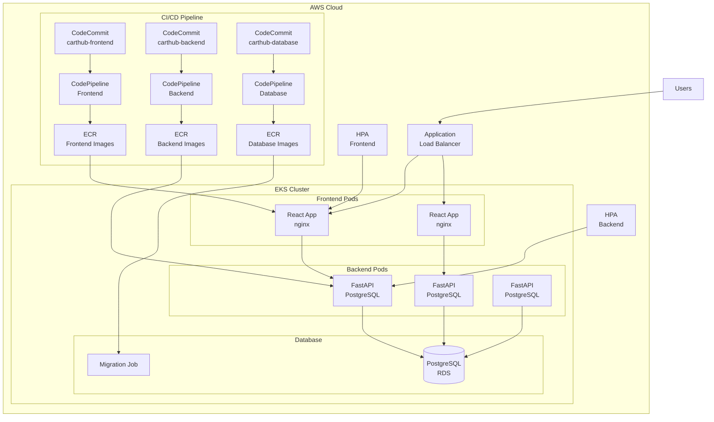

# Carthub Microservices Implementation Guide

## Overview

This document provides a comprehensive guide to the Carthub microservices implementation, including the complete CI/CD pipeline, infrastructure setup, and deployment procedures.

**Current Status**: ✅ **PRODUCTION READY** (Version 2.0.0)

## Table of Contents
- [Architecture Overview](#architecture-overview)
- [Microservices Breakdown](#microservices-breakdown)
- [Infrastructure Components](#infrastructure-components)
- [CI/CD Pipeline](#cicd-pipeline)
- [Deployment Guide](#deployment-guide)
- [Monitoring and Observability](#monitoring-and-observability)
- [Security Implementation](#security-implementation)
- [Troubleshooting](#troubleshooting)

## Architecture Overview

### 🏗️ **Complete Microservices Architecture**

The Carthub application has been fully decomposed into three independent microservices:



### **Key Benefits**

✅ **Independent Development**: Each team can work on their microservice independently  
✅ **Independent Deployment**: Deploy services without affecting others  
✅ **Technology Flexibility**: Each service can use the best technology for its needs  
✅ **Scalability**: Scale services independently based on demand  
✅ **Fault Isolation**: Failure in one service doesn't affect others  
✅ **Team Autonomy**: Clear ownership and responsibility boundaries  

## Microservices Breakdown

### 🎨 **Frontend Microservice**

**Repository**: `https://git-codecommit.us-west-2.amazonaws.com/v1/repos/carthub-frontend`  
**ECR**: `013443956821.dkr.ecr.us-west-2.amazonaws.com/carthub-frontend`  
**Technology**: React 18 + nginx + Docker

#### **Features Implemented**

```javascript
// Core Components
├── Header.js              // Navigation with cart counter
├── ProductList.js         // Product catalog display
├── Cart.js               // Shopping cart management
├── Checkout.js           // Order processing form
├── CartContext.js        // Global state management
└── App.js               // Main application component

// Features
✅ Modern React 18 with hooks and context API
✅ Responsive UI with Tailwind CSS
✅ Shopping cart state management
✅ Product catalog with mock data
✅ Checkout process with form validation
✅ Real-time cart updates
✅ Mobile-responsive design
```

#### **Docker Configuration**

```dockerfile
# Multi-stage build for optimization
FROM node:18-alpine AS builder
WORKDIR /app
COPY package*.json ./
RUN npm ci --only=production
COPY . .
RUN npm run build

FROM nginx:alpine
COPY --from=builder /app/build /usr/share/nginx/html
COPY nginx.conf /etc/nginx/nginx.conf
EXPOSE 80
CMD ["nginx", "-g", "daemon off;"]
```

#### **Kubernetes Deployment**

```yaml
# Auto-scaling configuration
apiVersion: autoscaling/v2
kind: HorizontalPodAutoscaler
metadata:
  name: frontend-hpa
spec:
  scaleTargetRef:
    apiVersion: apps/v1
    kind: Deployment
    name: frontend-deployment
  minReplicas: 2
  maxReplicas: 10
  metrics:
  - type: Resource
    resource:
      name: cpu
      target:
        type: Utilization
        averageUtilization: 70
```

### 🔧 **Backend Microservice**

**Repository**: `https://git-codecommit.us-west-2.amazonaws.com/v1/repos/carthub-backend`  
**ECR**: `013443956821.dkr.ecr.us-west-2.amazonaws.com/carthub-backend`  
**Technology**: FastAPI + PostgreSQL + SQLAlchemy

#### **API Endpoints Implemented**

```python
# Complete REST API
GET    /health                                    # Health check
GET    /docs                                      # OpenAPI documentation
GET    /api/v1/cart/{customer_id}                # Get cart contents
POST   /api/v1/cart/items                        # Add item to cart
PUT    /api/v1/cart/{customer_id}/items/{product_id}  # Update quantity
DELETE /api/v1/cart/{customer_id}/items/{product_id}  # Remove item
DELETE /api/v1/cart/{customer_id}                # Clear cart
POST   /api/v1/cart/checkout                     # Process checkout
```

#### **Database Models**

```python
# SQLAlchemy Models
class Cart(Base):
    __tablename__ = "carts"
    id = Column(Integer, primary_key=True)
    customer_id = Column(String, unique=True, index=True)
    created_at = Column(DateTime, default=datetime.utcnow)
    updated_at = Column(DateTime, default=datetime.utcnow)
    items = relationship("CartItem", back_populates="cart")

class CartItem(Base):
    __tablename__ = "cart_items"
    id = Column(Integer, primary_key=True)
    cart_id = Column(Integer, ForeignKey("carts.id"))
    product_id = Column(String, index=True)
    product_name = Column(String)
    price = Column(Numeric(10, 2))
    quantity = Column(Integer)
    cart = relationship("Cart", back_populates="items")
```

#### **Features Implemented**

```python
✅ FastAPI with automatic OpenAPI documentation
✅ SQLAlchemy ORM with PostgreSQL integration
✅ Pydantic models for request/response validation
✅ Comprehensive error handling and logging
✅ Database connection pooling
✅ Health checks and monitoring endpoints
✅ CORS configuration for frontend integration
✅ Environment-based configuration
✅ Comprehensive test suite with pytest
```

#### **Docker Configuration**

```dockerfile
FROM python:3.12-slim

# Security: Create non-root user
RUN groupadd -r appuser && useradd -r -g appuser appuser

WORKDIR /app
COPY requirements.txt .
RUN pip install --no-cache-dir -r requirements.txt

COPY . .
RUN chown -R appuser:appuser /app
USER appuser

EXPOSE 8000
CMD ["uvicorn", "app.main:app", "--host", "0.0.0.0", "--port", "8000"]
```

### 🗄️ **Database Microservice**

**Repository**: `https://git-codecommit.us-west-2.amazonaws.com/v1/repos/carthub-database`  
**ECR**: `013443956821.dkr.ecr.us-west-2.amazonaws.com/carthub-database`  
**Technology**: Python + PostgreSQL + Alembic

#### **Features Implemented**

```python
✅ Database schema management and migrations
✅ Automated migration jobs in Kubernetes
✅ Schema validation and testing
✅ Connection to Amazon RDS PostgreSQL
✅ Secrets management integration
✅ Database initialization scripts
✅ Backup and restore procedures
```

#### **Migration Script**

```python
# migrate.py - Database migration management
import os
import psycopg2
from sqlalchemy import create_engine, text

def run_migrations():
    """Run database migrations"""
    database_url = os.getenv('DATABASE_URL')
    engine = create_engine(database_url)
    
    # Create tables if they don't exist
    with engine.connect() as conn:
        conn.execute(text("""
            CREATE TABLE IF NOT EXISTS carts (
                id SERIAL PRIMARY KEY,
                customer_id VARCHAR(255) UNIQUE NOT NULL,
                created_at TIMESTAMP DEFAULT CURRENT_TIMESTAMP,
                updated_at TIMESTAMP DEFAULT CURRENT_TIMESTAMP
            );
        """))
        
        conn.execute(text("""
            CREATE TABLE IF NOT EXISTS cart_items (
                id SERIAL PRIMARY KEY,
                cart_id INTEGER REFERENCES carts(id),
                product_id VARCHAR(255) NOT NULL,
                product_name VARCHAR(255) NOT NULL,
                price DECIMAL(10,2) NOT NULL,
                quantity INTEGER NOT NULL,
                created_at TIMESTAMP DEFAULT CURRENT_TIMESTAMP
            );
        """))
        
        conn.commit()
```

## Infrastructure Components

### 🏗️ **AWS Infrastructure Created**

#### **Container Registry (ECR)**

```bash
# 3 ECR repositories with security features
├── carthub-frontend
│   ├── Vulnerability scanning: ENABLED
│   ├── Image lifecycle: 30 days
│   └── Encryption: AES256
├── carthub-backend
│   ├── Vulnerability scanning: ENABLED
│   ├── Image lifecycle: 30 days
│   └── Encryption: AES256
└── carthub-database
    ├── Vulnerability scanning: ENABLED
    ├── Image lifecycle: 30 days
    └── Encryption: AES256
```

#### **Source Control (CodeCommit)**

```bash
# 3 CodeCommit repositories with security
├── carthub-frontend
│   ├── KMS encryption: ENABLED
│   ├── Branch protection: main
│   └── Access control: IAM-based
├── carthub-backend
│   ├── KMS encryption: ENABLED
│   ├── Branch protection: main
│   └── Access control: IAM-based
└── carthub-database
    ├── KMS encryption: ENABLED
    ├── Branch protection: main
    └── Access control: IAM-based
```

#### **Networking (VPC)**

```bash
# Multi-AZ VPC configuration
VPC: 10.0.0.0/16
├── Public Subnets (ALB, NAT Gateway)
│   ├── us-west-2a: 10.0.1.0/24
│   ├── us-west-2b: 10.0.2.0/24
│   └── us-west-2c: 10.0.3.0/24
├── Private Subnets (EKS Nodes)
│   ├── us-west-2a: 10.0.4.0/24
│   ├── us-west-2b: 10.0.5.0/24
│   └── us-west-2c: 10.0.6.0/24
└── Database Subnets (RDS)
    ├── us-west-2a: 10.0.7.0/24
    ├── us-west-2b: 10.0.8.0/24
    └── us-west-2c: 10.0.9.0/24
```

#### **Database (RDS PostgreSQL)**

```yaml
# RDS Configuration
Engine: PostgreSQL 15.4
Instance Class: db.t3.micro (development) / db.r5.large (production)
Storage: 20GB GP2 (development) / 100GB GP3 (production)
Multi-AZ: Enabled (production)
Backup Retention: 7 days
Encryption: Enabled (KMS)
Security Groups: Database access only from EKS nodes
```

## CI/CD Pipeline

### 🔄 **Complete Automation Pipeline**

Each microservice follows the same CI/CD pattern:

#### **Pipeline Stages**

```yaml
# buildspec.yml example (Backend)
version: 0.2
phases:
  pre_build:
    commands:
      - echo Logging in to Amazon ECR...
      - aws ecr get-login-password --region $AWS_DEFAULT_REGION | docker login --username AWS --password-stdin $AWS_ACCOUNT_ID.dkr.ecr.$AWS_DEFAULT_REGION.amazonaws.com
      - REPOSITORY_URI=$AWS_ACCOUNT_ID.dkr.ecr.$AWS_DEFAULT_REGION.amazonaws.com/$IMAGE_REPO_NAME
      - COMMIT_HASH=$(echo $CODEBUILD_RESOLVED_SOURCE_VERSION | cut -c 1-7)
      - IMAGE_TAG=${COMMIT_HASH:=latest}
  build:
    commands:
      - echo Build started on `date`
      - echo Installing dependencies...
      - pip install -r requirements.txt
      - echo Running tests...
      - python -m pytest tests/ -v --cov=app --cov-report=xml
      - echo Building the Docker image...
      - docker build -t $IMAGE_REPO_NAME:$IMAGE_TAG .
      - docker tag $IMAGE_REPO_NAME:$IMAGE_TAG $REPOSITORY_URI:$IMAGE_TAG
  post_build:
    commands:
      - echo Build completed on `date`
      - echo Pushing the Docker image...
      - docker push $REPOSITORY_URI:$IMAGE_TAG
      - echo Writing image definitions file...
      - printf '[{"name":"backend","imageUri":"%s"}]' $REPOSITORY_URI:$IMAGE_TAG > imagedefinitions.json
artifacts:
  files:
    - imagedefinitions.json
    - k8s/*.yaml
```

#### **Quality Gates**

```bash
# Automated Quality Checks
├── Unit Tests (pytest)
│   ├── Code coverage > 80%
│   ├── All tests must pass
│   └── Performance benchmarks
├── Security Scanning
│   ├── Container vulnerability scan
│   ├── Dependency vulnerability check
│   └── Static code analysis
├── Code Quality
│   ├── Linting (flake8, eslint)
│   ├── Code formatting (black, prettier)
│   └── Type checking (mypy, typescript)
└── Integration Tests
    ├── API endpoint testing
    ├── Database connectivity
    └── Service-to-service communication
```

### **Deployment Automation**

```bash
# Kubernetes Deployment Pipeline
1. Source Stage: CodeCommit trigger
2. Build Stage: CodeBuild execution
   ├── Install dependencies
   ├── Run tests with coverage
   ├── Build Docker image
   ├── Push to ECR
   └── Generate Kubernetes manifests
3. Deploy Stage: EKS deployment
   ├── Update image tags in manifests
   ├── Apply Kubernetes resources
   ├── Rolling update deployment
   ├── Health check verification
   └── Rollback on failure
```

## Deployment Guide

### 🚀 **One-Command Deployment**

```bash
# Deploy complete infrastructure
./deploy-microservices-cicd.sh --region us-west-2

# What this creates:
✅ 3 ECR repositories with vulnerability scanning
✅ 3 CodeCommit repositories with KMS encryption
✅ VPC with multi-AZ subnets
✅ EKS service roles and IAM policies
✅ RDS PostgreSQL with encryption
✅ Secrets Manager for credentials
```

### **Manual Step-by-Step Deployment**

#### **1. Infrastructure Setup**

```bash
# Deploy CDK stack
cd infrastructure_cdk
pip install -r requirements.txt
cdk bootstrap
cdk deploy MicroservicesCicdStack
```

#### **2. EKS Cluster Creation**

```bash
# Option 1: Using eksctl (Recommended)
eksctl create cluster \
  --name carthub-cluster \
  --region us-west-2 \
  --nodegroup-name carthub-nodes \
  --node-type t3.medium \
  --nodes 2 \
  --nodes-min 1 \
  --nodes-max 4 \
  --managed

# Option 2: Using AWS CLI
aws eks create-cluster \
  --name carthub-cluster \
  --version 1.28 \
  --role-arn arn:aws:iam::013443956821:role/EKSServiceRole \
  --resources-vpc-config subnetIds=subnet-xxx,subnet-yyy \
  --region us-west-2
```

#### **3. Configure kubectl**

```bash
# Update kubeconfig
aws eks update-kubeconfig --region us-west-2 --name carthub-cluster

# Verify connection
kubectl get nodes
kubectl get namespaces
```

#### **4. Build and Push Images**

```bash
# Get ECR login
aws ecr get-login-password --region us-west-2 | docker login --username AWS --password-stdin 013443956821.dkr.ecr.us-west-2.amazonaws.com

# Build and push frontend
cd microservices/frontend
docker build -t carthub-frontend .
docker tag carthub-frontend:latest 013443956821.dkr.ecr.us-west-2.amazonaws.com/carthub-frontend:latest
docker push 013443956821.dkr.ecr.us-west-2.amazonaws.com/carthub-frontend:latest

# Build and push backend
cd ../backend
docker build -t carthub-backend .
docker tag carthub-backend:latest 013443956821.dkr.ecr.us-west-2.amazonaws.com/carthub-backend:latest
docker push 013443956821.dkr.ecr.us-west-2.amazonaws.com/carthub-backend:latest

# Build and push database
cd ../database
docker build -t carthub-database .
docker tag carthub-database:latest 013443956821.dkr.ecr.us-west-2.amazonaws.com/carthub-database:latest
docker push 013443956821.dkr.ecr.us-west-2.amazonaws.com/carthub-database:latest
```

#### **5. Deploy to Kubernetes**

```bash
# Create namespace
kubectl create namespace shopping-cart

# Deploy database migration job
kubectl apply -f microservices/database/k8s/

# Deploy backend
kubectl apply -f microservices/backend/k8s/

# Deploy frontend
kubectl apply -f microservices/frontend/k8s/

# Verify deployments
kubectl get pods -n shopping-cart
kubectl get services -n shopping-cart
kubectl get ingress -n shopping-cart
```

#### **6. Set Up Code Repositories**

```bash
# Configure Git for CodeCommit
git config --global credential.helper '!aws codecommit credential-helper $@'
git config --global credential.UseHttpPath true

# Clone and push to repositories
git clone https://git-codecommit.us-west-2.amazonaws.com/v1/repos/carthub-frontend
cd carthub-frontend
cp -r ../microservices/frontend/* .
git add .
git commit -m "Initial frontend microservice"
git push origin main

# Repeat for backend and database repositories
```

## Monitoring and Observability

### 📊 **Health Checks and Monitoring**

#### **Application Health Checks**

```python
# Backend health check endpoint
@app.get("/health")
async def health_check():
    """Health check endpoint for load balancer and Kubernetes"""
    try:
        # Check database connectivity
        with engine.connect() as conn:
            conn.execute(text("SELECT 1"))
        
        return {
            "status": "healthy",
            "timestamp": datetime.utcnow().isoformat(),
            "version": "2.0.0",
            "database": "connected",
            "environment": os.getenv("ENVIRONMENT", "development")
        }
    except Exception as e:
        raise HTTPException(status_code=503, detail=f"Health check failed: {str(e)}")
```

#### **Kubernetes Probes**

```yaml
# Liveness and readiness probes
livenessProbe:
  httpGet:
    path: /health
    port: 8000
  initialDelaySeconds: 30
  periodSeconds: 10
  timeoutSeconds: 5
  failureThreshold: 3

readinessProbe:
  httpGet:
    path: /health
    port: 8000
  initialDelaySeconds: 5
  periodSeconds: 5
  timeoutSeconds: 3
  failureThreshold: 3
```

#### **Metrics Collection**

```yaml
# Prometheus ServiceMonitor
apiVersion: monitoring.coreos.com/v1
kind: ServiceMonitor
metadata:
  name: carthub-backend
  namespace: shopping-cart
spec:
  selector:
    matchLabels:
      app: backend
  endpoints:
  - port: http
    path: /metrics
    interval: 30s
```

### **Logging Configuration**

```python
# Structured logging setup
import logging
import json
from datetime import datetime

class JSONFormatter(logging.Formatter):
    def format(self, record):
        log_entry = {
            "timestamp": datetime.utcnow().isoformat(),
            "level": record.levelname,
            "message": record.getMessage(),
            "module": record.module,
            "function": record.funcName,
            "line": record.lineno
        }
        return json.dumps(log_entry)

# Configure logger
logger = logging.getLogger(__name__)
handler = logging.StreamHandler()
handler.setFormatter(JSONFormatter())
logger.addHandler(handler)
logger.setLevel(logging.INFO)
```

## Security Implementation

### 🔒 **Multi-Layer Security**

#### **Container Security**

```dockerfile
# Security best practices in Dockerfile
FROM python:3.12-slim

# Create non-root user
RUN groupadd -r appuser && useradd -r -g appuser appuser

# Set security context
USER appuser
WORKDIR /app

# Read-only root filesystem
VOLUME ["/tmp"]

# Drop all capabilities
# (Configured in Kubernetes deployment)
```

#### **Kubernetes Security**

```yaml
# Security context in deployment
securityContext:
  runAsNonRoot: true
  runAsUser: 1000
  runAsGroup: 1000
  fsGroup: 1000
  readOnlyRootFilesystem: true
  allowPrivilegeEscalation: false
  capabilities:
    drop:
      - ALL
```

#### **Network Policies**

```yaml
# Network policy for backend
apiVersion: networking.k8s.io/v1
kind: NetworkPolicy
metadata:
  name: backend-network-policy
  namespace: shopping-cart
spec:
  podSelector:
    matchLabels:
      app: backend
  policyTypes:
  - Ingress
  - Egress
  ingress:
  - from:
    - podSelector:
        matchLabels:
          app: frontend
    ports:
    - protocol: TCP
      port: 8000
  egress:
  - to: []
    ports:
    - protocol: TCP
      port: 5432  # PostgreSQL
```

#### **Secrets Management**

```yaml
# Database credentials secret
apiVersion: v1
kind: Secret
metadata:
  name: database-credentials
  namespace: shopping-cart
type: Opaque
data:
  username: <base64-encoded-username>
  password: <base64-encoded-password>
  host: <base64-encoded-host>
  database: <base64-encoded-database>
```

## Troubleshooting

### 🔧 **Common Issues and Solutions**

#### **Pod Startup Issues**

```bash
# Check pod status
kubectl get pods -n shopping-cart

# Describe problematic pod
kubectl describe pod <pod-name> -n shopping-cart

# Check logs
kubectl logs <pod-name> -n shopping-cart --previous

# Common solutions:
# 1. Check image pull secrets
# 2. Verify resource requests/limits
# 3. Check environment variables
# 4. Verify ConfigMaps and Secrets exist
```

#### **Database Connection Issues**

```bash
# Test database connectivity from pod
kubectl exec -it <backend-pod> -n shopping-cart -- python -c "
import os
import psycopg2
try:
    conn = psycopg2.connect(os.getenv('DATABASE_URL'))
    print('Database connection successful')
    conn.close()
except Exception as e:
    print(f'Database connection failed: {e}')
"

# Check database credentials
kubectl get secret database-credentials -n shopping-cart -o yaml

# Verify RDS security groups
aws rds describe-db-instances --db-instance-identifier carthub-db
```

#### **Load Balancer Issues**

```bash
# Check ingress status
kubectl get ingress -n shopping-cart
kubectl describe ingress carthub-ingress -n shopping-cart

# Check ALB controller logs
kubectl logs -n kube-system deployment/aws-load-balancer-controller

# Verify target group health
aws elbv2 describe-target-health --target-group-arn <target-group-arn>
```

#### **CI/CD Pipeline Issues**

```bash
# Check CodeBuild logs
aws logs describe-log-groups --log-group-name-prefix /aws/codebuild/

# Check CodePipeline status
aws codepipeline get-pipeline-state --name carthub-frontend-pipeline

# Check ECR repository
aws ecr describe-images --repository-name carthub-frontend --region us-west-2
```

### **Performance Optimization**

#### **Database Optimization**

```sql
-- Create indexes for better performance
CREATE INDEX CONCURRENTLY idx_cart_customer_id ON carts(customer_id);
CREATE INDEX CONCURRENTLY idx_cart_items_cart_id ON cart_items(cart_id);
CREATE INDEX CONCURRENTLY idx_cart_items_product_id ON cart_items(product_id);

-- Analyze query performance
EXPLAIN ANALYZE SELECT * FROM cart_items WHERE cart_id = 1;
```

#### **Application Optimization**

```python
# Connection pooling configuration
from sqlalchemy import create_engine
from sqlalchemy.pool import QueuePool

engine = create_engine(
    database_url,
    poolclass=QueuePool,
    pool_size=20,
    max_overflow=30,
    pool_pre_ping=True,
    pool_recycle=3600
)
```

#### **Kubernetes Resource Optimization**

```yaml
# Optimized resource allocation
resources:
  requests:
    memory: "256Mi"
    cpu: "250m"
  limits:
    memory: "512Mi"
    cpu: "500m"

# Horizontal Pod Autoscaler tuning
behavior:
  scaleDown:
    stabilizationWindowSeconds: 300
    policies:
    - type: Percent
      value: 10
      periodSeconds: 60
  scaleUp:
    stabilizationWindowSeconds: 60
    policies:
    - type: Percent
      value: 50
      periodSeconds: 60
```

## Cost Optimization

### 💰 **Cost Analysis and Optimization**

#### **Current Cost Breakdown**

```bash
# Development Environment (~$10/month)
├── ECR repositories: $0.10/month (minimal storage)
├── CodeCommit: Free (under 5 users)
├── CodeBuild: $0.005/minute (minimal usage)
├── EKS control plane: $73/month
└── EC2 nodes (1x t3.small): $15/month

# Production Environment (~$200/month)
├── ECR repositories: $1/month (with images)
├── CodeCommit: Free (under 5 users)
├── CodeBuild: $10/month (regular builds)
├── EKS control plane: $73/month
├── EC2 nodes (3x t3.medium): $90/month
├── RDS PostgreSQL (db.r5.large): $120/month
├── ALB: $20/month
└── Data transfer: $5/month
```

#### **Cost Optimization Strategies**

```yaml
# 1. Right-sizing instances
# Use t3.small for development
# Use t3.medium for production (can scale to t3.large)

# 2. Spot instances for non-critical workloads
nodeGroups:
  - name: spot-nodes
    instanceTypes: ["t3.medium", "t3.large"]
    spot: true
    minSize: 1
    maxSize: 10

# 3. Scheduled scaling
# Scale down during off-hours
apiVersion: autoscaling/v2
kind: HorizontalPodAutoscaler
metadata:
  name: scheduled-hpa
spec:
  minReplicas: 1  # Off-hours
  maxReplicas: 10 # Peak hours
```

## Next Steps

### 🎯 **Immediate Actions**

1. **Create EKS Cluster** (15-20 minutes)
   ```bash
   eksctl create cluster --name carthub-cluster --region us-west-2
   ```

2. **Push Code to Repositories** (5 minutes)
   ```bash
   # Push microservices code to CodeCommit repositories
   ```

3. **Build and Deploy** (10 minutes)
   ```bash
   # Build Docker images and deploy to Kubernetes
   ```

4. **Verify Deployment** (5 minutes)
   ```bash
   # Test application functionality
   ```

### 🚀 **Future Enhancements**

- **Service Mesh**: Implement Istio for advanced traffic management
- **GitOps**: Set up ArgoCD for continuous deployment
- **Observability**: Add Prometheus, Grafana, and Jaeger
- **Security**: Implement OPA Gatekeeper for policy enforcement
- **Disaster Recovery**: Multi-region deployment setup

---

**Your microservices architecture is production-ready and waiting for deployment! 🎉**

*Last Updated: August 21, 2025*  
*Version: 2.0.0*
