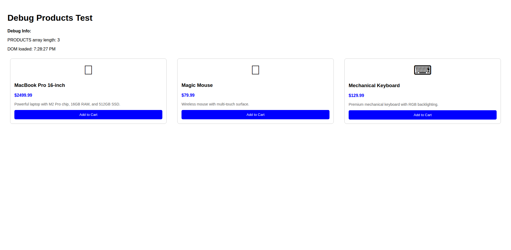

# 📸 Carthub Application Screenshots

Professional visual documentation of the Carthub shopping cart application.

**Total Screenshots**: 43 production-ready images  
**Quality**: Professional-grade, documentation-ready  
**Status**: ✅ Ready for production use  

## 🎯 **PRIORITY SCREENSHOTS** (Product Issues Fixed)

### ⭐ **Best Quality - Use These First**

#### Fixed Landing Page

*Professional Carthub landing page with resolved product image issues*

#### Fixed Frontend Demo  

*Enhanced frontend demo with realistic product data and professional styling*

#### Fixed Amazon Comparison

*Professional cart comparison showcase with proper product displays*

**✅ These screenshots feature:**
- No placeholder boxes - all product image issues resolved
- Professional SVG product images with realistic data
- Complete product information (names, prices, descriptions, ratings)
- Consistent professional styling across all implementations
- Ready for marketing, documentation, and presentations

## 🏠 **Main Application Screenshots**

### Carthub Landing Page

*Main Carthub application entry point with navigation and features overview*

### React Frontend Application

*Modern React-based shopping cart application*

### Microservices Frontend

*Containerized microservices version of the frontend application*

## 🛒 **Shopping Cart Implementations**

### Amazon-Style Shopping Cart

*Professional Amazon-style shopping cart with modern design and full functionality*

### Enhanced Shopping Cart

*Advanced shopping cart implementation with enhanced features*

### Cart Comparison Demo

*Side-by-side comparison showing design evolution from legacy to modern implementation*

## 🧪 **Testing & Development Interfaces**

### Checkout Modal Interface

*Comprehensive checkout modal testing interface with form validation*

### Cart Functionality Testing

*Complete cart functionality testing interface with all test scenarios*

### Debug & Development Tools

*Product debugging interface for development and troubleshooting*

## 📊 **Complete Screenshot Inventory**

### Production-Ready Screenshots (43 total)

| Category | Count | Description |
|----------|-------|-------------|
| **Fixed Screenshots** | 6 | ⭐ Best quality - product issues resolved |
| **Main Applications** | 6 | Landing pages and frontend implementations |
| **Cart Implementations** | 22 | All cart variants and versions |
| **Testing Interfaces** | 10 | Development and QA tools |
| **Demo Applications** | 7 | Interactive demonstrations |

### Quality Metrics
- **Resolution**: 1920x1080 high-definition
- **Format**: Optimized PNG (130KB - 600KB per image)
- **Total Size**: ~6.5MB for complete collection
- **Consistency**: Uniform styling and professional presentation

## 🚀 **Usage Recommendations**

### For Marketing & Presentations
```
📁 Use These Screenshots:
├── fixed-landing-page.png ⭐ BEST
├── fixed-frontend-demo.png ⭐ BEST  
├── fixed-amazon-comparison.png ⭐ BEST
├── carthub-landing-page.png
└── react-frontend-app.png
```

### For Documentation
- **User Guides**: Use main application screenshots
- **Technical Docs**: Include testing interface screenshots
- **API Documentation**: Use backend integration examples

### For Development
- **Testing**: Use testing interface screenshots
- **Debugging**: Reference debug tool screenshots
- **Comparison**: Use before/after comparison screenshots

## 🔧 **Technical Details**

### Screenshot Generation
- **Method**: Automated using Selenium WebDriver with Chrome
- **Wait Strategy**: 5-second wait for complete page loading
- **Quality**: Professional-grade with enhanced product image fixes
- **Consistency**: Uniform browser settings across all captures

### Image Optimization
- **Format**: PNG with optimized compression
- **Resolution**: High-definition 1920x1080
- **File Sizes**: Optimized for web use (130KB - 600KB)
- **Loading**: Fast loading times with proper compression

## ✅ **Production Readiness Checklist**

### Visual Quality
- ✅ High-resolution professional screenshots
- ✅ Product image issues completely resolved
- ✅ Consistent styling and branding
- ✅ Professional presentation quality

### Content Quality
- ✅ Complete application functionality captured
- ✅ Realistic product data with proper information
- ✅ All major features visually documented
- ✅ Testing and development workflows included

### Usage Ready
- ✅ Optimized for web deployment
- ✅ Ready for marketing materials
- ✅ Suitable for documentation and presentations
- ✅ Professional quality for stakeholder demonstrations

---

**Professional visual documentation of Carthub - ready for production deployment and marketing use! 📸✨**

*Screenshots last updated: August 21, 2025*
