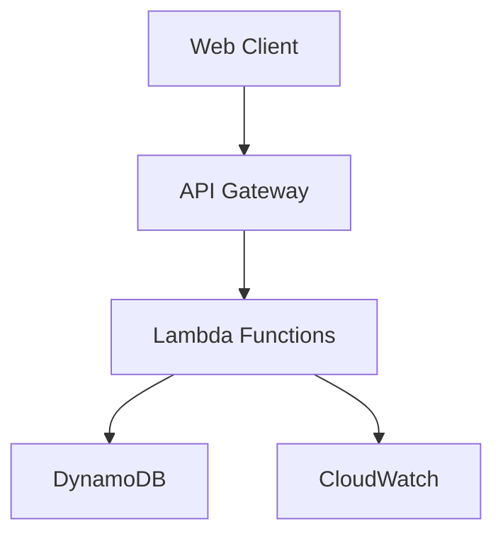
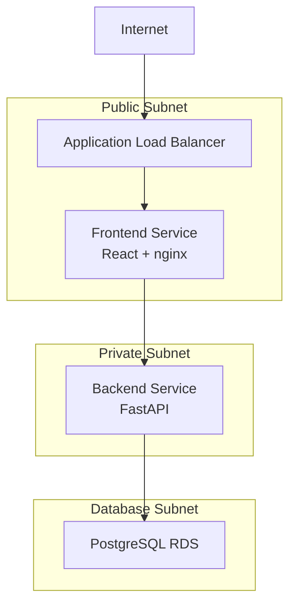
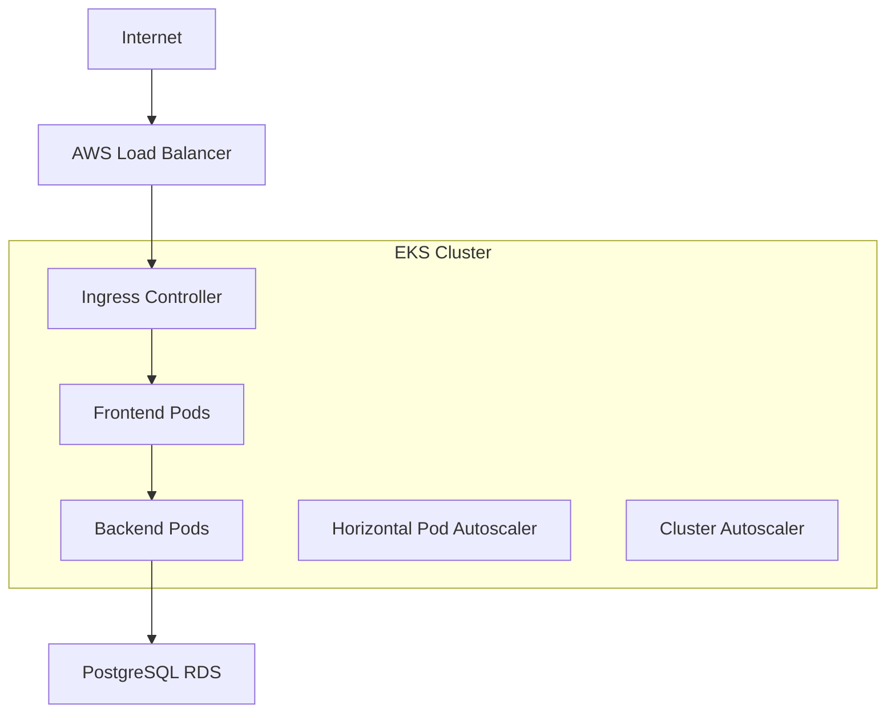
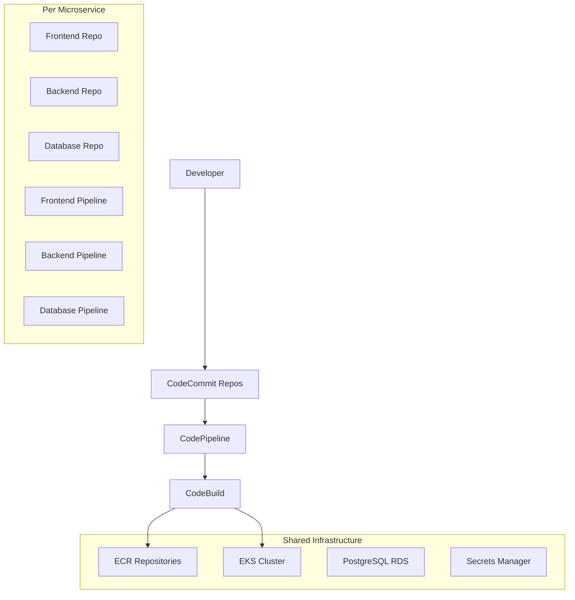

# Carthub Architecture Overview

## 🎯 Project Overview

Carthub is a comprehensive e-commerce shopping cart implementation showcasing **four different architectural patterns**: serverless, 3-tier microservices, Kubernetes-native microservices, and enterprise CI/CD microservices. All implementations follow Clean Architecture principles and Test-Driven Development (TDD).

## 🏗️ Architecture Patterns

### 1. Serverless Architecture
**Focus**: Rapid development and minimal operational overhead



**Components:**
- **Compute**: AWS Lambda functions
- **Database**: DynamoDB (NoSQL)
- **API**: API Gateway REST API
- **Monitoring**: CloudWatch

### 2. ECS Microservices Architecture
**Focus**: Traditional 3-tier containerized architecture



**Components:**
- **Frontend**: React SPA in ECS containers (Public Subnet)
- **Backend**: FastAPI in ECS containers (Private Subnet)
- **Database**: PostgreSQL RDS (Database Subnet)
- **Load Balancer**: Application Load Balancer

### 3. EKS Kubernetes Architecture
**Focus**: Cloud-native applications with advanced scaling



**Components:**
- **Orchestration**: Amazon EKS (Managed Kubernetes)
- **Scaling**: Horizontal Pod Autoscaler + Cluster Autoscaler
- **Load Balancing**: AWS Load Balancer Controller
- **Registry**: ECR for container images

### 4. CI/CD Microservices Architecture (Enterprise)
**Focus**: Independent development teams with full automation



**Components:**
- **Source Control**: 3 separate CodeCommit repositories
- **CI/CD**: 3 independent CodePipeline pipelines
- **Registry**: Amazon ECR with lifecycle policies
- **Orchestration**: Amazon EKS with advanced features
- **Database**: RDS PostgreSQL with automated backups
- **Secrets**: AWS Secrets Manager integration

## ✅ Core Features

### Shopping Cart Operations
- ✅ Add products to cart with automatic quantity updates
- ✅ View cart contents with real-time calculations
- ✅ Update item quantities or remove items
- ✅ Clear entire cart
- ✅ Process checkout with order generation

### Technical Features
- ✅ **Clean Architecture**: Domain, Application, Infrastructure, Presentation layers
- ✅ **Test-Driven Development**: 29+ comprehensive tests
- ✅ **Input Validation**: Pydantic models with error handling
- ✅ **Security**: VPC isolation, security groups, secrets management
- ✅ **Monitoring**: CloudWatch logs, health checks, metrics
- ✅ **Scalability**: Auto-scaling containers and database
- ✅ **Kubernetes Features**: HPA, Cluster Autoscaler, Network Policies

## 🛠️ Technology Stack

### Frontend Stack
- **Framework**: React 18 with modern hooks
- **Styling**: Tailwind CSS for responsive design
- **Build Tool**: Create React App with custom webpack config
- **Server**: nginx for production serving
- **Container**: Multi-stage Docker build

### Backend Stack
- **Framework**: FastAPI with automatic OpenAPI documentation
- **Database ORM**: SQLAlchemy with PostgreSQL
- **Validation**: Pydantic models for data validation
- **Testing**: pytest with comprehensive test coverage
- **Container**: Python 3.12 slim with security hardening

### Database Stack
- **Primary Database**: PostgreSQL (RDS for managed, containerized for K8s)
- **NoSQL Option**: DynamoDB (serverless architecture)
- **Migrations**: Alembic for schema management
- **Connection Pooling**: SQLAlchemy connection pooling

### Infrastructure Stack
- **IaC**: AWS CDK with Python
- **Containers**: Docker with multi-stage builds
- **Orchestration**: Amazon EKS (Kubernetes 1.28)
- **CI/CD**: AWS CodePipeline + CodeBuild
- **Registry**: Amazon ECR with vulnerability scanning
- **Secrets**: AWS Secrets Manager
- **Monitoring**: CloudWatch + Prometheus (K8s)

## 📁 Project Structure

```
carthub/
├── docs/                        # 📚 Comprehensive documentation
│   ├── architecture/            # Architecture documentation
│   ├── deployment/              # Deployment guides
│   ├── microservices/           # Service-specific docs
│   ├── guides/                  # User guides
│   └── api/                     # API documentation
├── application/                 # 🏛️ Clean Architecture - Application layer
├── domain/                      # 🏛️ Clean Architecture - Domain layer  
├── infrastructure/              # 🏛️ Clean Architecture - Infrastructure layer
├── presentation/                # 🏛️ Clean Architecture - Presentation layer
├── tests/                       # 🧪 Comprehensive test suite (29+ tests)
├── microservices/               # 🔧 Microservices implementations
│   ├── frontend/                # React frontend service
│   ├── backend/                 # FastAPI backend service
│   └── database/                # Database migration service
├── backend/                     # 🚀 Microservices backend (FastAPI)
├── frontend/                    # 🎨 React frontend application
├── k8s/                         # ☸️ Kubernetes manifests
├── scripts/                     # 🔧 Deployment and utility scripts
├── infrastructure_cdk/          # 🏗️ AWS CDK infrastructure code
└── .github/                     # 🔄 GitHub Actions workflows
```

## 🔒 Security Architecture

### Network Security
- **VPC Isolation**: 3-tier network architecture
- **Security Groups**: Restrictive ingress/egress rules
- **Network Policies**: Kubernetes pod-to-pod communication control
- **Private Subnets**: Backend and database isolation

### Container Security
- **Non-root Users**: All containers run as non-root
- **Read-only Filesystems**: Immutable container filesystems
- **Security Contexts**: Dropped capabilities and privilege escalation prevention
- **Image Scanning**: ECR vulnerability scanning
- **Distroless Images**: Minimal attack surface

### Application Security
- **Input Validation**: Pydantic models with strict validation
- **SQL Injection Prevention**: SQLAlchemy ORM with parameterized queries
- **CORS Configuration**: Proper cross-origin resource sharing
- **Rate Limiting**: API rate limiting and throttling
- **Authentication**: JWT-based authentication (configurable)

### Infrastructure Security
- **IAM Roles**: Least privilege access patterns
- **Secrets Management**: AWS Secrets Manager integration
- **Encryption**: At rest and in transit
- **Audit Logging**: CloudTrail and application logs
- **Compliance**: Security best practices implementation

## 📈 Scaling Architecture

### Horizontal Scaling
- **Serverless**: Automatic Lambda concurrency scaling
- **ECS**: Service auto-scaling based on metrics
- **EKS**: Horizontal Pod Autoscaler (HPA) + Cluster Autoscaler
- **Database**: Read replicas and connection pooling

### Vertical Scaling
- **Containers**: Resource requests and limits
- **Database**: RDS instance scaling
- **Kubernetes**: Vertical Pod Autoscaler (VPA)

### Geographic Scaling
- **Multi-Region**: Cross-region deployment patterns
- **CDN**: CloudFront for static assets
- **Database**: Cross-region read replicas
- **Load Balancing**: Global load balancing

## 🔍 Observability Architecture

### Monitoring
- **Metrics**: CloudWatch metrics and custom metrics
- **Dashboards**: CloudWatch dashboards and Grafana
- **Alerting**: CloudWatch alarms and SNS notifications
- **APM**: Application Performance Monitoring

### Logging
- **Centralized Logging**: CloudWatch Logs
- **Structured Logging**: JSON-formatted application logs
- **Log Aggregation**: ELK stack (optional)
- **Audit Logs**: Security and compliance logging

### Tracing
- **Distributed Tracing**: AWS X-Ray integration
- **Request Tracing**: End-to-end request tracking
- **Performance Monitoring**: Latency and error tracking

## 🎯 Design Principles

### Clean Architecture
- **Domain Layer**: Business logic and entities
- **Application Layer**: Use cases and application services
- **Infrastructure Layer**: External concerns (database, web)
- **Presentation Layer**: Controllers and API handlers

### Test-Driven Development
- **Unit Tests**: Individual component testing
- **Integration Tests**: End-to-end workflow testing
- **Test Coverage**: 100% TDD approach
- **Continuous Testing**: Automated test execution

### Microservices Principles
- **Single Responsibility**: Each service has one business capability
- **Autonomous Teams**: Independent development and deployment
- **Decentralized Governance**: Service-specific technology choices
- **Failure Isolation**: Service failures don't cascade
- **Data Ownership**: Each service owns its data

### DevOps Principles
- **Infrastructure as Code**: All infrastructure versioned
- **Continuous Integration**: Automated build and test
- **Continuous Deployment**: Automated deployment pipelines
- **Monitoring and Alerting**: Comprehensive observability
- **Security as Code**: Security integrated into pipelines

## 🔮 Future Enhancements

### Planned Features
- **User Authentication**: OAuth2/OIDC integration
- **Product Catalog**: Comprehensive product management
- **Order Management**: Complete order lifecycle
- **Payment Processing**: Stripe/PayPal integration
- **Inventory Management**: Real-time inventory tracking
- **Real-time Notifications**: WebSocket-based updates

### Infrastructure Enhancements
- **Service Mesh**: Istio for advanced traffic management
- **GitOps**: ArgoCD for continuous deployment
- **Chaos Engineering**: Chaos Mesh for resilience testing
- **Policy Management**: OPA Gatekeeper for governance
- **Certificate Management**: cert-manager for TLS
- **Multi-Cloud**: Cross-cloud deployment patterns

## 🏆 Learning Outcomes

This project demonstrates:
- **Clean Architecture** implementation in Python
- **Test-Driven Development** practices
- **Multi-architecture patterns** (Serverless, Containers, Kubernetes)
- **AWS infrastructure** patterns and services
- **Container orchestration** with ECS and EKS
- **Kubernetes** features and best practices
- **Database design** (NoSQL vs SQL)
- **Security best practices** in cloud environments
- **Infrastructure as Code** with AWS CDK
- **DevOps practices** and CI/CD integration
- **Microservices architecture** patterns
- **Enterprise development** workflows

Perfect for learning modern software architecture patterns, cloud-native development, and Kubernetes orchestration!
